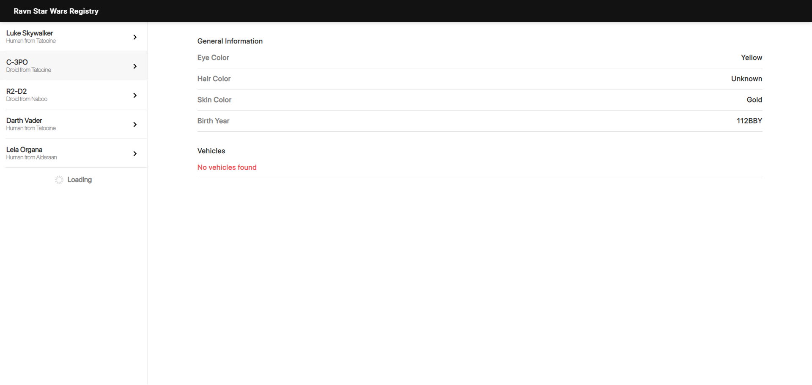
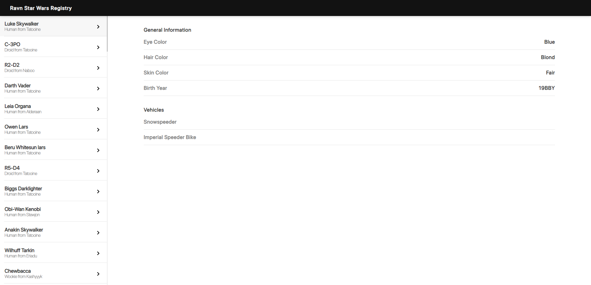
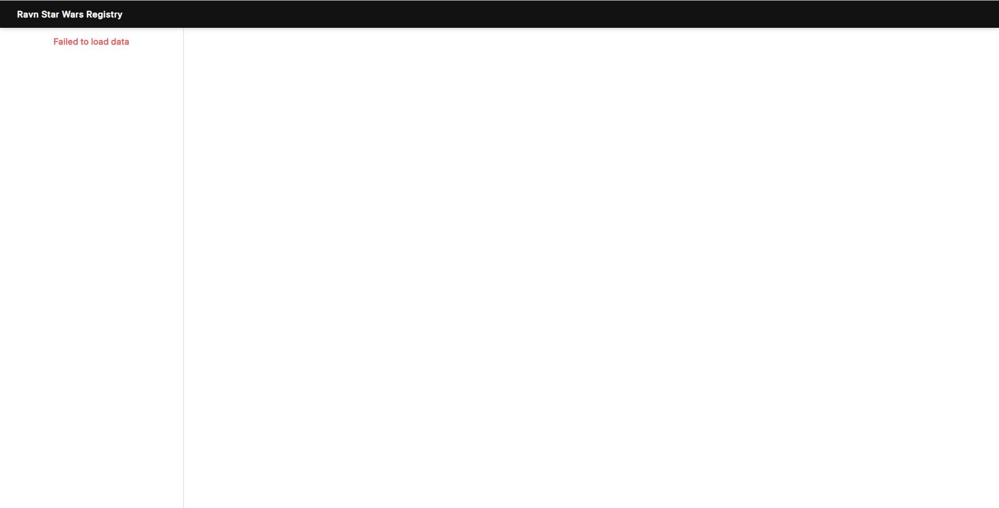

# Ravn Star Wars Registry

This project has been developed for challenge purposes, the app consists in one view with three components: Header, Navigation bar, and dynamic view.
The application shows a list of several characters fetched from a graphql API (with Star Wars Theme), and shows detailed information about the clicked character in view.
## Live Preview
## Screenshots





## Built With

### Frameworks
- 
- 
- 
- 

### Languages and preprocessors
- 
- 

### Package Managers
- 
- 

### Editors
- 

### Version controlers
- 
- 

### Deployment
- 


## Getting Started

### Installation

1. Clone the repo

   git clone https://github.com/hunter4466/Ravn-Challenge-V2-Mario-Chois.git

2. Open your favorite code editor

   cd ...~/Ravn-Challenge-V2-Mario-Chois


### Usage

1. Install recomended node version (Use NVM)

   ```sh
   nvm instal 14.16.0
   ```
   ```sh
   nvm use 14.16.0
   ```

2. Install node dependencies

   ```sh
   npm install
   ```

3. Run the web server

   ```sh
   npm run start
   ```

4. Open your web browser on:

   ```sh
   http://localhost:3000
   ```

### Assumptions

- Added a subtle scrollbar to let the users know there are more items shown below,
followed the design pattern to mantain same style concept.

## Author

👤 **Mario Chois**
 (Click the linked badges below)
- [](https://github.com/hunter4466/)
- [](https://www.linkedin.com/in/mario-chois-5a13b6b6/)
- [](https://angel.co/u/mario-chois)

 
## 🤝 Contributing

Contributions, issues, and feature requests are welcome!

Feel free to check the [issues page](https://github.com/hunter4466/Ravn-Challenge-V2-Mario-Chois/issues).

## Show your support

Give a ⭐️ if you like this project!

## 📝 License

This project is [MIT](https://github.com/hunter4466/Ravn-Challenge-V2-Mario-Chois/blob/development/LICENSE) licensed.
